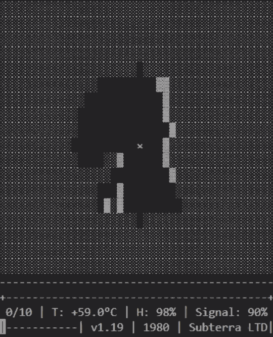

# Ascii Horror Game

 \

### Story
Story: in the 80s, a deep cave was found but couldn't be explored. A robot was sent 3km down. You're the engineer controlling it from the surface.

### Starting The Game

```sh
pip install -r requirements.txt
python game.py
```


> [!WARNING]  
> This content contains flashing lights and patterns that may trigger seizures in people with photosensitive epilepsy. Please proceed with caution


---
<sub>*A horror game in the terminal*<sub/>
